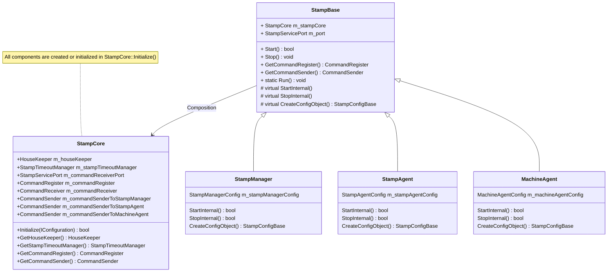
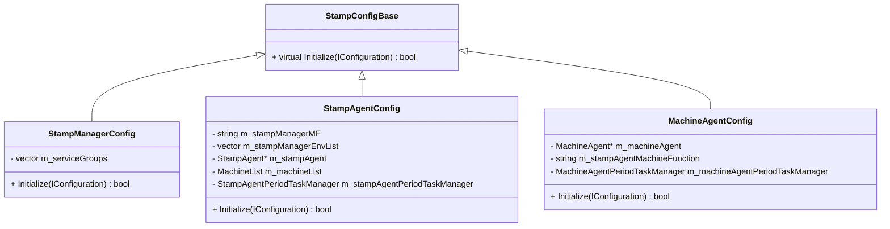
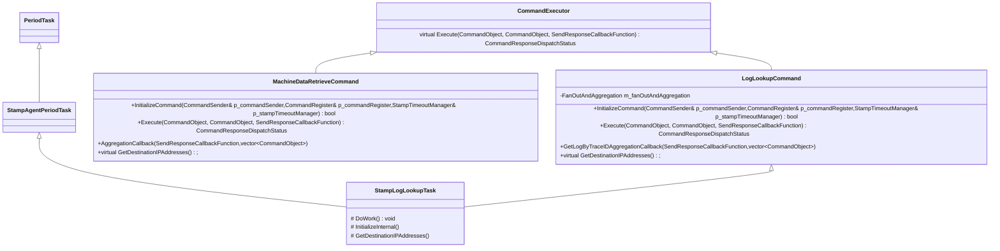

- [StampManager Design Doc](#stampmanager-design-doc)
  - [Key Components Design](#key-components-design)
    - [StampBase](#stampbase)
      - [Class Diagram](#class-diagram)
    - [StampBaseConfig](#stampbaseconfig)
      - [Execution Path](#execution-path)
    - [StampCore](#stampcore)
    - [Commander](#commander)
    - [Bond Definition](#bond-definition)
    - [CommandExecutor](#commandexecutor)
  - [Fanout Design](#fanout-design)
  - [How to add metric](#how-to-add-metric)
    - [StampAgent Level](#stampagent-level)
    - [MachineAgent Level](#machineagent-level)
  - [Reference](#reference)

# StampManager Design Doc

## Key Components Design

### StampBase

#### Class Diagram



- Here is `Template Method` of design pattern, `StampBase` is a abstract class, `StampManager/StampAgent/MachineAgent` are concrete class, `StampBase` defines the skeleton of an algorithm in an operation, and defers some steps to subclasses. `StampManager/StampAgent/MachineAgent` implement the `StartInternal()` and `StopInternal()` methods to carry out specific step.
then use static method `StampBase::Run(StampBase& p_stampBase)` to start StampManager/StampAgent/MachineAgent, here p_stampBase is a reference of sub class `StampManager/StampAgent/MachineAgent`

- `StampCore` is a composition of `StampBase`, `StampCore` is responsible for creating and initializing all the components, e.g `StampCore::Initialize()` is responsible for creating and initializing `HouseKeeper`, `StampTimeoutManager`, `CommandRegister`, `CommandReceiver`, `CommandSender` for StampManager/StampAgent/MachineAgent, `CommanderReceiver` is inherited from `StampCommandHandler_Service` which is a `bond::Service`, when `CommanderReceiver` was initialized, the bond server started to listen on `StampServicePort` port, then `CommanderReceiver` will receive command from StampManager/StampAgent/MachineAgent, then deserialize it to `StampCommand` object, then dispatch it to `CommandRegister` to execute its `Execute()` method based on its `bondClassName` field.

### StampBaseConfig



- `CreateConfigObject()` is called by `StampBase::Initialize()` to create config object for StampManager/StampAgent/MachineAgent, each derived class should implement its own `CreateConfigObject()` method based on its config class, then call `Initialize()` method of its config class to initialize its config object, e.g `m_stampManagerConfig.Initialize(config)`

#### Execution Path

- `StartInternal()` and `StopInternal()` are called by `StampBase::Start()` and `StampBase::Stop()` respectively but implemented in derived class (StampManager/StampAgent/MachineAgent)

    ```c++
    // SubClass is one of StampManager/StampAgent/MachineAgent
    main()
        SubClass subClass;
        StampBase:
            Run(subclass)
                Start()
                    Initialize()
                        StampConfigBase:
                            CreateConfigObject()
                            Initialize()
                                RegisterCleanupCallback()
                                CreatePeriodTaskManager()
                                    PeriodTaskManager:
                                        Initialize()
                                            ConcretePeriodTask:
                                                Initialize()
                                                    InitializeInternal() // Implemented in each concrete period task.
                                                        PeriodTask::InitializeCommand() // LogLookupTaskCommand is registered to CommandRegister here.
                                                            RegisterCommand()
                        StampCore:
                            CreateStampCore()
                            Initialize()
                                CreateCommandRegister()
                                CreateCommandReceiver() // Bond server started to listen on StampServicePort port here.
                                CreateCommandSender()
                    StartInternal() // MA/SA/SM implements StartInternal() method.
                        StartPeriodTask()
                Stop()
                    StopInternal()
                        StopPeriodTask()
    ```

### StampCore

 `StampCore` is a composition of `StampBase`, `StampCore` is responsible for creating and initializing all the core components, e.g `StampCore::Initialize()` is responsible for creating and initializing `HouseKeeper`, `StampTimeoutManager`, `CommandRegister`, `CommandReceiver`, `CommandSender` for StampManager/StampAgent/MachineAgent.

### Commander

- Kind of Command
  - CommandReceiver
    - Implement service StampCommandHandler defined in `StampCommand.bond`
  - CommandRegister
    - Register command to CommandExecuterMap
    - Dispatch command to execute its `Execute()` method
  - CommandSender
    - Responsible for sending command to StampManager/StampAgent/MachineAgent
    - Mainly include `Send_Sync` and `Send_Async` methods

- How command is sent and received
  - StampManager intends to support many kinds of request type, such as `GetLogByTraceId`, `MachineDataRetrieve`. Generally, for different request types we have two options to deal with:

    - Option1: Create different service interface for different request type, e.g `GetLogByTraceIdService`, `MachineDataRetrieveService`, then register it to `bond::Service` with different port binding.

    - Option2: Create a generic service interface `StampCommandHandler` for all request types, which only exposes one RPC service interface `void Execute(StampCommand, StampCommandResponse)`, then use `bondClassName` to identify request type. Different requests are unified to `StampCommand` object, when `ConmmandReceiver` received a `StampCommand`, it then deserialize it to concrete request object, a `CommandObject`, based on its `bondClassName` field.

    For StampManager, it choose Option2.

  - Before Sending request to service, each request, e.g `GetLogByTraceIdCommand` is wrapped into a `CommandObject` object, then serialized this `CommandObject` to `bond::blob` object, which will be stored in `StampCommand` object, then send this `StampCommand` object to service. When service received this `StampCommand` object, it will deserialize it to `CommandObject` object with the passed `bond::blob`. Different commands are register to `CommandRegister` at initliazation phase, then `CommandRegister` will dispatch this `CommandObject` to its `Execute()` method based on its `bondClassName` field.

    - Using filed `bondClassName` to identify command type, serialize CommandObject to `bond::blob` before send (CommandSender), then deserialize to concrete command object when received (CommanderReceiver)

    - CommandObject store request data (traceId, request stamp endpoint)

    - CommandObject is sent to StampManager at first, then forward to StampAgent, then forward to MachineAgent, all necessary information is stored in CommandObject

        ```c++
        // CommandSender: serialize CommandObject to blob, then wrap it into StampCommand (request) before send.
        CommandSender::Send_Async(
            std::string& p_ipAddress,
            const appfun::CommandObject& p_command,
            const boost::function<void (const boost::shared_ptr<appfun::CommandObject>&)>& p_callback)
        {
            bond::SocketAddress address(p_ipAddress.c_str(), static_cast<UInt16>(m_port));

            boost::shared_ptr<StampCommandHandler_Proxy> stampCommandHandlerProxy =
                boost::make_shared<StampCommandHandler_Proxy>(m_clientStore->GetClient(address),
                                                                bond::COMPACT_PROTOCOL);

            stampCommandHandlerProxy->EnableCompression(m_encodingType);

            // Prepare request.
            StampCommand stampCommand;
            stampCommand.m_bondClassName = p_command.GetBondClassName();
            stampCommand.m_senderIdentifier = 0;
            stampCommand.m_dataBlob = p_command.Serialize();

            // ASync call.
            stampCommandHandlerProxy->Execute(stampCommand,
                                            HandleAsyncCommandCallback(p_response, p_callback, address));
        }

        // CommandReceiver: deserialize StampCommand (request) to get reql CommandObject,
        // then invoke its Execute() method based on its bondClassName field from CommandRegister.
        // CommandReceiver::Execute() is RPC service interface implementation.
        CommandReceiver::Execute(
            const bond::message<StampCommand>& input,
            const boost::function<void (const bond::message<StampCommandResponse&>&)>& callback)
        {
            // Retrieve request data.
            StampCommand stampCommand;
            input.payload().Deserialize(stampCommand);

            boost::shared_ptr<appfun::CommandObject> command(CommandObjectFactory::CreateCommandObject(stampCommand.m_bondClassName));
            boost::scoped_ptr<appfun::CommandObject> commandResponse;
            command->DeSerialize(stampCommand.m_dataBlob);

            // CommandRegister has registered all the commands at initialization phase, typically in StartPeriodTask -> PeriodTask::InitializeCommand
            CommandResponseDispatchStatus dispatchStatus =
                m_commandRegister.Invoke(stampCommand.m_bondClassName,
                                            command,
                                            commandResponse,
                                            boost::bind(CommandReceiver::SendResponse,
                                                        stampCommand.m_senderIdentifier,
                                                        startTime,
                                                        callback,
                                                        _1));
        }
        ```

### Bond Definition

- Request and Response

    ```c++
    struct StampCommand
    {
        1: string m_bondClassName;
        2: UInt32 m_senderIdentifier;
        3: blob m_dataBlob;
    };

    struct StampCommandResponse
    {
        1: string m_bondClassName;
        2: UInt32 m_senderIdentifier;
        3: blob m_dataBlob;
    };
    ```

- Service Interface

    ```c++
    service StampCommandHandler
    {
        StampCommandResponse Execute(StampCommand);
    };
    ```

- Life Time of Bond Request and CommandObject

  - Build bond request from CommandObject: a command object is wrapped in bond request `StampCommand` as a `bond::blob` object before sending to StampManager/StampAgent/MachineAgent

  - Send bond request: bond request is sent to StampManager/StampAgent/MachineAgent with `CommandSender::Send_Sync` or `CommandSender::Send_Async`

  - Parse command from request: get `bondClassName` from `StampCommand`, then deserialize `StampCommand`s `bond::blob` field to get concrete `CommandObject`.

    ```c++
    // Retrieve request data.
    StampCommand stampCommand;
    input.payload().Deserialize(stampCommand);

    // Create a command object based on its bondClassName field.
    boost::shared_ptr<appfun::CommandObject> command(CommandObjectFactory::CreateCommandObject(stampCommand.m_bondClassName));
    boost::scoped_ptr<appfun::CommandObject> commandResponse;

    // Deserialize request data to command object.
    // Different command object has different Deserialize method.
    command->DeSerialize(stampCommand.m_dataBlob);
    ```

  - Dispatch command object: a command object is dispatched to its `Execute()` method

  - Execute command object: a command object is executed its `Execute()` method

    ```c++
    // Under CommanderRegister
    CommandResponseDispatchStatus
    CommandRegister::Invoke(const std::string& p_commandBondClassName,
                        boost::shared_ptr<appfun::CommandObject>& p_command,
                        boost::scoped_ptr<appfun::CommandObject>& p_commandResponse,
                        const SendResponseCallbackFunction& p_sendResponseCallback) const
    {
        CommandExecuterMap::const_iterator iter = m_commandExecuterMap.find(p_commandBondClassName);
        if (iter != m_commandExecuterMap.end())
        {
            return iter->second->Execute(p_command, p_commandResponse, p_sendResponseCallback);
        }
        // Do other things
    }
    ```

### CommandExecutor



## Fanout Design

- Call Path

    ```mermaid
    %% flowchart TD
    flowchart LR
    StampManagerLogLookupTask-->RegisterCommand --> InitializeCommand

    BuildCommand-->CommandSender
    CommandSender-->CommandReceiver
    CommandReceiver-->ParseCommand
    ParseCommand-->DispatchCommand
    DispatchCommand-->Execute
    Execute-->FanOut
    FanOut-->Send_Async
    Send_Async-->HandleAsyncSingleCommandCallback
    HandleAsyncSingleCommandCallback-->AddResponseAndMaybeDispatch
    AddResponseAndMaybeDispatch-->FanOutComplete
    Send_Async-->FanOutTimeOut
    FanOutTimeOut-->FanOutComplete
    FanOutComplete-->AggregationCallback
    AggregationCallback-->SendResponseCallback
    ```

- Class Diagram

    ```mermaid
    classDiagram
        class LogLookupCommand{
            - FanOutAndAggregation m_fanOutAndAggregation
            + InitializeCommand(CommandSender& p_commandSender,CommandRegister& p_commandRegister,StampTimeoutManager& p_stampTimeoutManager) bool
            + Execute(CommandObject, CommandObject, SendResponseCallbackFunction) CommandResponseDispatchStatus
            + GetLogByTraceIDAggregationCallback(SendResponseCallbackFunction,vector~CommandObject~)
            + virtual GetDestinationIPAddresses()
        }
    ```

- Register Command (Execute in PeriodTask)

    ```c++
    bool
    LogLookupCommand::InitializeCommand(apsdk::Ptr<const IConfiguration>& p_config,
                                        const char* p_section,
                                        CommandSender& p_commandSender,
                                        CommandRegister& p_commandRegister,
                                        StampTimeoutManager& p_stampTimeoutManager)
    {
        // Register as a command receiver, so that could receive commands from StampManager.
        p_commandRegister.RegistCommand(CommandObjectType<GetLogByTraceIDCommand>::GetName(),
                                        this);

        m_fanOutAndAggregation.reset(new FanOutAndAggregation(p_commandSender,
                                                              p_stampTimeoutManager,
                                                              responseTimeoutInMS));
    }
    ```

- Core Get Log Logic (Invoke in Execute)

    ```c++
    void
    LogLookupCommand::ExecuteGetLogByTraceIDCommand(
        boost::shared_ptr<appfun::CommandObject>& p_command,
        const SendResponseCallbackFunction& p_sendResponseCallback)
    {
        // We are expecting GetLogByTraceIDCommand.
        GetLogByTraceIDCommand& getLogByTraceIDCommand =
            TemplateUtility::GetInternalObject<GetLogByTraceIDCommand>(*p_command);

        // Get Fanout ipaddress.
        std::vector<std::string> fanOutMachineIpAddresses;
        GetDestinationIPAddresses(getLogByTraceIDCommand.m_endPoint, fanOutMachineIpAddresses, getLogByTraceIDCommand.m_traceID);

        // Fanout.
        m_fanOutAndAggregation->FanOut(fanOutMachineIpAddresses,
                                        p_command,
                                        boost::bind(&LogLookupCommand::GetLogByTraceIDAggregationCallback,
                                                    this,
                                                    p_sendResponseCallback,
                                                    getLogByTraceIDCommand.m_traceID,
                                                    _1),
                                        m_reissueCount,
                                        m_stopReissueRemainingCount);
    }
    ```

- Fanout Core

    ```c++
    void
    FanOutAndAggregation::FanOut(std::vector<std::string>& p_fanOutMachineIpAddresses,
                                 boost::shared_ptr<appfun::CommandObject>& p_command,
                                 const AggregateCallbackFunction& p_aggregateCallbackFunction,
                                 UInt32 p_reissueCount,
                                 UInt32 p_stopReissueRemainingCount)
    {
        boost::weak_ptr<ResponseContainer> weakResponseContainer;

        boost::shared_ptr<ResponseContainer> responseContainer(
            new ResponseContainer(p_reissueCount,
                                  p_aggregateCallbackFunction,
                                  *this,
                                  p_fanOutMachineIpAddresses,
                                  p_command,
                                  p_stopReissueRemainingCount));

        responseContainer->SelfContain();

        weakResponseContainer = responseContainer;

        BOOST_FOREACH (std::string& ipAddress, p_fanOutMachineIpAddresses)
        {
            m_commandSender.Send_Async(ipAddress,
                                       *p_command,
                                       boost::bind(&FanOutAndAggregation::HandleAsyncSingleCommandCallback,
                                                   weakResponseContainer,
                                                   ipAddress,
                                                   _1));
        }
    }

    // Single response handler.
    void
    FanOutAndAggregation::HandleAsyncSingleCommandCallback(
        boost::weak_ptr<ResponseContainer> p_weakResponseContainer,
        const std::string& p_ipAddress,
        const boost::shared_ptr<appfun::CommandObject>& p_commandResponse)
    {
        boost::shared_ptr<ResponseContainer> responseContainer = p_weakResponseContainer.lock();

        responseContainer->AddResponseAndMaybeDispatch(p_ipAddress, p_commandResponse);
    }

    void
    ResponseContainer::AddResponseAndMaybeDispatch(
        const std::string& p_ipAddress,
        const boost::shared_ptr<appfun::CommandObject>& p_commandResponse)
    {
        // ignore empty response.
        if (p_commandResponse == nullptr)
        {
            return;
        }

        // lookup fanout entry.
        auto it = m_fanOutEntries.find(p_ipAddress);

        if (it == m_fanOutEntries.end())
        {
            return;
        }

        // This is the first time to receive response.
        if (it->second.Increment() == 1)
        {
            UInt32 currentResponseCount = m_responsesCount.Increment();
            // add response.
            boost::atomic_store(&m_commandResponses[currentResponseCount - 1],
                                p_commandResponse);

            // Ready to dispatch.
            if (currentResponseCount == static_cast<UInt32>(m_fanOutEntries.size()))
            {
                FanOutComplete();
            }
        }
    }

    // Fanout complete.
    ResponseContainer::FanOutComplete()
    {
        if (0 == ::InterlockedDecrement(&m_cleanupRefCount))
        {
            bool reissue = false;
            std::vector<std::string> reissueIPAddress;
            string_stream remainingIPAddressString;

            UInt32 currentResponseCount = m_responsesCount.Value();
            UInt32 totalRequestedCount = static_cast<UInt32>(m_fanOutEntries.size());

            // Reissue logic.
            // xxx

            // Copy a response copy (they are all just pointers, and shrimp to the real size.)
            std::vector<boost::shared_ptr<appfun::CommandObject>> commandResponses;
            commandResponses.reserve(currentResponseCount);
            for (UInt32 i = 0; i < currentResponseCount; ++i)
            {
                commandResponses.push_back(m_commandResponses[i]);
            }

            // call back aggregation.
            m_aggregateCallbackFunction(commandResponses);

            // Cleanup.
            m_shared_from_this.reset();
        }
    }
    ```

- AggregationCallback

    ```c++
    void
    LogLookupCommand::GetLogByTraceIDAggregationCallback(
        const SendResponseCallbackFunction& p_sendResponseCallback,
        const std::string& p_traceID,
        const std::vector<boost::shared_ptr<appfun::CommandObject>>& p_commandResponses)
    {
        boost::scoped_ptr<appfun::CommandObject> commandResponse;
        GetLogByTraceIDCommandResponse& getLogByTraceIDCommandResponse =
            CommandObjectFactory::CreateCommandObject<GetLogByTraceIDCommandResponse>(commandResponse);

        // go through all the response.
        // dedup logic.
        std::set<std::string> dedupSet;
        BOOST_FOREACH(const boost::shared_ptr<appfun::CommandObject>& machineAgentCommandResponse, p_commandResponses)
        {
            // ignore null response.
            if (machineAgentCommandResponse == nullptr)
            {
                continue;
            }

            // Get response from machine agent.
            GetLogByTraceIDCommandResponse& machineAgentGetLogByTraceIDCommandResponse =
                TemplateUtility::GetInternalObject<GetLogByTraceIDCommandResponse>(*machineAgentCommandResponse);

            // push all the logs getting from machine agent into the response.
            BOOST_FOREACH(GetLogByTraceIDCommandEntry& entry, machineAgentGetLogByTraceIDCommandResponse.m_entries)
            {
                std::string dedupEntry = entry.m_log;
                dedupEntry += entry.m_commandResponseEndPoint.m_stamp + entry.m_commandResponseEndPoint.m_machine;

                auto iter = dedupSet.find(dedupEntry);
                if (iter == dedupSet.end())
                {
                    dedupSet.insert(dedupEntry);

                    if (m_sort)
                    {
                        entry.m_sortHint = ExtractTimeStamp(entry.m_log);
                    }

                    getLogByTraceIDCommandResponse.m_entries.push_back(entry);
                }
            }
        }
        // dispatch.
        p_sendResponseCallback(commandResponse.get());
    }
    ```

- Service level Response

    ```c++
    CommandReceiver::SendResponse(
        UInt32 p_senderIdentifier,
        const boost::function<void (const bond::message<StampCommandResponse&>&)>& p_callback,
        appfun::CommandObject* p_commandResponse)
    {
        StampCommandResponse stampCommondResponse;
        stampCommondResponse.m_bondClassName = p_commandResponse->GetBondClassName();
        // Store CommandObject to blob.
        stampCommondResponse.m_dataBlob = p_commandResponse->Serialize();
        stampCommondResponse.m_senderIdentifier = p_senderIdentifier;
        // dispatch.
        p_callback(stampCommondResponse);
    }
    ```

## How to add metric

### StampAgent Level

- StampManagerLogLookupTask
  - Add member std::unordered_map<string, string> IP2StampAgentMap;

  - Build IP2StampAgentMap after GetDestinationIPAddress

    ```c++
    StampManagerLogLookupTask::GetDestinationIPAddresses(
        const StampRespEndPoint& p_stampRespEndPoint,
        std::vector<std::string>& p_ipAddresses,
        const std::string& p_traceID)
    {
        DebugLogAssert(m_serviceGroup != NULL);
        StampManagerCommandDestinationHelper::GetDestinationIPAddresses(
            *m_serviceGroup,
            p_stampRespEndPoint,
            p_ipAddresses,
            m_useOnlineStampOnly);

        // TODO: Build IP2StampAgentMap with filled p_ipAddress;
    }
    ```

- FanOutAndAggregation.cpp

  - Option1: Add a weak_ptr to LogLookupCommand (StampManagerLookUpTask extends from LogLookupCommand), thus we can access IP2StampAgentMap from FanoutAndAggregation

  - Option2: Add a new interface which accepts IP2StampAgentMap as params

  - ResponseContainer.cpp

    - Add member std::vector\<std::string\> respondedStampAgentList to ResponseContainer

    - In AddResponseAndMaybeDispatch:

      - Once a new valid ipAddress respond, query IP2StampAgentMap, add corresponding StampAgent name to the returned StampAgent set.

  - Log or metric responded StampAgent in FanOutComplete method (After reissue method)

### MachineAgent Level

- StampLogLookupTask
  - Add member std::unordered_map<string, string> IP2MachineAgentMap;

  - Build IP2MachineAgentMap after GetDestinationIPAddress

    ```c++
    void StampLogLookupTask::GetDestinationIPAddresses(
        const StampRespEndPoint& p_stampRespEndPoint,
        std::vector<std::string>& p_ipAddresses,
        const std::string& p_traceID)
    {
        StampAgentCommandDestinationHelper::GetDestinationIPAddresses(
            *m_stampAgent,
            p_stampRespEndPoint,
            p_ipAddresses);

        // TODO: Build IP2MachineAgentMap with filled p_ipAddress;
    }
    ```

- FanOutAndAggregation
  - Similar to StampAgent Level

## Reference

- [Add MDM counter to record rpc call latency and QPS for StampManager](https://msasg.visualstudio.com/DefaultCollection/Bing_and_IPG/_git/IndexServe/pullrequest/4123091)